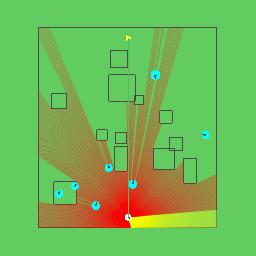

## Pretraining through behaviour cloning
This work explores the effects of initialising reinforcement learning using a pretrained policy. The most important contributions are in the following files:

- [`train_gym_e2enavreppretrainenv.py`](navrep/scripts/train_gym_e2enavreppretrainenv.py)
  - Training script including pretraining
- [`e2eenv.py`](navrep/envs/e2eenv.py)
  - Adds environment wrappers (`E2ENavRepEnvPretrain`, `E2EIANEnvPretrain`) to reshape the observation outputs.
- [`expert_policy.py`](navrep/tools/expert_policy.py)
  - Implements the expert policy and a method to record the actions and observations to create the expert data set.

Below shows first and example of execution of the expert policy, and then execution of a pretrained policy.



## Usage
To train a model using a pretrained initialisation, run:
```bash
python -m navrep.scripts.train_gym_e2enavreppretrainenv
```

## Credits

This library was written primarily by Daniel Dugas. The transformer block codes, and vae/lstm code were taken or heavily derived from world models and karpathy's mingpt. We've retained the copyright headers for the relevant files.
