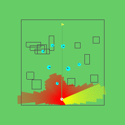

# Curiosity driven learning 


This is the branch which has implemented the curiosity driven learning approach.
The repository contains 2 versions of the curiosity wrapper :

- `curiosity.py`  : Contains the intrinsic curiosity module including custom dynamics and embedding networks
- `curiosity_v2.py` : New version, where the predictor and embedding networks are coming directly from NavRep's encoded enviroments (VAE/LSTM/GPT)


## Train using only the curiosity reward signal
Version 1 : 
```
python -m navrep.envs.train_gym_e2enavreptrainenv_curiosity
```
Version 2 : 
```
python -m navrep.envs.train_gym_e2enavreptrainenv_curiosity_v2
```
## Working with the curiosity wrapper
Navrep's original enviroments can be wrapped using the `CuriosityWrapper` class from `curiosity{_v2}.py` in order to change the reward signal to a curiosity based one.
```
env = CuriosityWrapper(NavRepTrainEnvCuriosity(silent=True, scenario='train')
```

## Logs
The trained predictor network for version 1 of the curiosity module are stored in `~/navrep/models/curiosity/`
