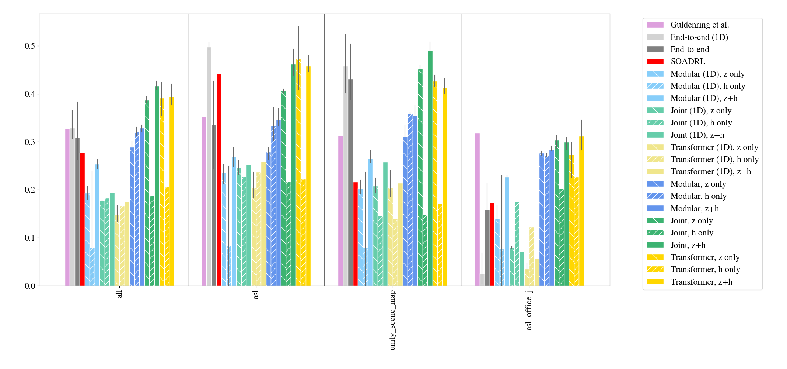

# Testing Your Trained Models with NavRep

This tutorial will give you an example of how to adapt an existing navigation model to be tested in the 
NavRep test environment.

To demonstrate the procedure, we take the pretrained models from
[Guldenring et al.](http://ras.papercept.net/images/temp/IROS/files/0122.pdf),
adapt them and test them with NavRep.

First, as a quick summary of the procedure:
1. Load your model in python
2. Wrap the NavRep test environment to convert its inputs and outputs to your model's requirements
3. Wrap your model to fit the expected API
4. Run the tests

Let's go over each step in detail.

## Step 1:
Load your model in python. For the Guldenring example, we find the models in the authors
[github repository](https://github.com/RGring/drl_local_planner_ros_stable_baselines/tree/master/example_agents).
To load them, we must first clone their repository:
```
git clone git@github.com:danieldugas/drl_local_planner_ros_stable_baselines.git
```

then, install a subset of their libraries:
```
source ~/navrepvenv/bin/activate
cd drl_local_planner_ros_stable_baselines/rl_agent
pip install -e .
```

We can now check that everything works in python
```
cd ..
ipython
In [1]: from stable_baselines.ppo2 import PPO2
In [2]: model = PPO2.load("example_agents/ppo2_1_raw_data_cont_0/ppo2_1_raw_data_cont_0.pkl")
```


## Step 2: 
We need to wrap the environment to convert inputs and outputs, into a format acceptable to the model

At the minimum, the environment wrapper should look something like this:

```
class GuldenringWrapperForIANEnv(IANEnv):
    def _convert_obs(self, ianenv_obs):
        guldenring_obs = ... SOME CONVERSION TAKES PLACE HERE ...
        return guldenring_obs

    def _convert_action(self, guldenring_action):
        ianenv_action = ... SOME CONVERSION TAKES PLACE HERE ...
        return ianenv_action

    def step(self, guldenring_action):
        ianenv_action = self._convert_action(guldenring_action)
        ianenv_obs, reward, done, info = super(GuldenringWrapperForIANEnv, self).step(ianenv_action)
        guldenring_obs = self._convert_obs(ianenv_obs)
        return guldenring_obs, reward, done, info

    def reset(self, *args, **kwargs):
        ianenv_obs = super(GuldenringWrapperForIANEnv, self).reset(*args, **kwargs)
        guldenring_obs = self._convert_obs(ianenv_obs)
        return guldenring_obs
```

We simply need to figure out what to fill in for each conversion method.

### inputs

The model trained by Guldenring et al. outputs 2 values, a forward velocity, and rotational velocity.
IANEnv, the NavRep train environment, on the other hand, requires 3 output values: forward velocity, sideway velocity, and rotational velocity.

As a result, it's straightforward to convert from one to the other:

```
def _convert_action(self, guldenring_action):
    vx, omega = guldenring_action
    ianenv_action = np.array([vx, 0., omega])
    return ianenv_action
```

### outputs

Looking at the loaded model, we notice the observation space is 
```
In [3]: model.observation_space
Out[3]: Box(1, 106, 1)
```

Good, now we know the shape of the observation. But how do we find out what's in it?

Inside the class [RosEnvRaw](https://github.com/danieldugas/drl_local_planner_ros_stable_baselines/blob/cb8091376797e93f55a4fa55093d4366aafdcc0f/rl_agent/src/rl_agent/env_wrapper/ros_env_raw_data.py#L18),
the method get_observation_ tells us what the observation consists of:

```
[...]
state[0, 0:self.__scan_size, 0] = self.merged_scan_.ranges

# add goal position
wp_index = self.STATE_SIZE[1] - num_of_wps * 2
for i in range(num_of_wps):
    state[0, (wp_index + i*2):(wp_index + i*2 + 2),0] = [waypoint.points[i].x, waypoint.points[i].y]

# Discretize to a resolution of 5cm.
state = np.round(np.divide(state, 0.05))*0.05
[...]
```
a lidar scan, and 8 waypoints with 2 xy values each.

Printing the merged_scan_ member, we notice that it is a 90-ray lidar scan in meters, starting at -180 degrees, ending at 180 degrees.
```
header:
  seq: 0
  stamp:
    secs: 253
    nsecs: 100002531
  frame_id: "base_footprint"
angle_min: -3.1415927410125732
angle_max: 3.1415927410125732
angle_increment: 0.06981316953897476
time_increment: 0.0
scan_time: 0.0
range_min: 0.05000000074505806
range_max: 10.0
ranges: [10.         10.          7.73780775  7.42524433  7.4270525   7.73187637
 10.         10.         10.         10.          3.79725647  3.25623536
  3.0226059   2.93152881  2.81104994  2.82258916  2.8012228   2.88034058
  2.9839406   3.22793508  3.67810678 10.         10.         10.
  9.96161747  9.77609539  9.67138004  9.62429237  9.56087303  9.60784245
  9.66775417  9.81278324  9.69876003  7.83352661  6.61193419  5.72545004
  5.08842993  4.62048578  4.21292686  3.89961076  3.65783405  3.43156314
  3.28789616  3.12791371  3.02099657  2.94785047  2.86451745  2.80725598
  2.78657293  2.73826313  2.72300005  2.69697309  2.75378537  2.79325819
  2.78654218  2.8714776   2.94882703  3.05337286  3.12504292  3.30924201
  3.48385644  3.68308043  3.91936541  4.25103951  4.66307926  5.17567539
  5.84622192  6.76530933  8.06729984  9.58756542  9.42510128  9.30700779
  9.54259968 10.         10.         10.         10.         10.
 10.          6.69388008  6.9378767   7.22125769  7.57841539  7.99598074
  8.56274509  9.19065857 10.         10.         10.         10.        ]
intensities: []
```


The output of IANenv, the NavRep test environment, is a 1080-ray lidar scan starting at 0 degrees,
which means that we need to downsample and rotate the lidar scan by 180 degrees:

```
def _convert_obs(self, ianenv_obs):
    scan, robotstate = ianenv_obs
    guldenring_obs = np.zeros((1, _90 + _8 * 2, 1))
    # rotate lidar scan so that first ray is at -pi
    rotated_scan = np.zeros_like(scan)
    rotated_scan[:_540] = scan[_540:]
    rotated_scan[_540:] = scan[:_540]
    # 1080-ray to 90-ray: for each angular section we take the min of the returns
    lidar_upsampling = _1080 // _90
    downsampled_scan = rotated_scan.reshape((-1, lidar_upsampling))
    downsampled_scan = np.min(downsampled_scan, axis=1)
    guldenring_obs[0, :_90, 0] = downsampled_scan
    # fill in waypoints with current goal
    for n_wpt in range(_8):
        guldenring_obs[0, _90 + n_wpt * 2:_90 + n_wpt * 2 + 2, 0] = robotstate[:2]
    # Discretize to a resolution of 5cm.
    guldenring_obs = np.round(np.divide(guldenring_obs, 0.05))*0.05
    return guldenring_obs
```


## Step 3:
Now, we need to wrap the model to fit the expected C policy API

In the NavRep testing, we call `action = policy.act(observation)`. Writing the wrapper to fit this API is simple:

```
class GuldenringCPolicy():
    def __init__(self):
        self.model = PPO2.load(os.path.expanduser(
            "~/Code/drl_local_planner_ros_stable_baselines/example_agents/ppo2_1_raw_data_cont_0/ppo2_1_raw_data_cont_0.pkl"))  # noqa

    def act(self, obs):
        action, _state = self.model.predict(obs, deterministic=True)
        return action
```


## Step 4:
The final step: runnning the model in ianenv, and collecting data.

Thankfully, functions are already implemented for this in NavRep.
All we need to do here is to write the above wrappers into a `cross_test_guldenring_in_ianenv.py` file,
and add a `__main__` block which runs the test function. 

```
if __name__ == '__main__':
    env = GuldenringWrapperForIANEnv()
    policy = GuldenringCPolicy()

    S = run_test_episodes(env, policy, render=True, num_episodes=1000)

    S.to_csv("lucianavreptrain_in_ianenv.csv")
```


## Conclusion

We've made all the above code available in the file [cross_test_guldenring_in_ianenv.py](navrep/scripts/cross_test_guldenring_in_ianenv.py),
plus a few lines of code for handling command line arguments and visualization.

Feel free to run it directly with
```
python -m navrep.scripts.cross_test_guldenring_in_ianenv
```

Once the test is over, visualize the results with

```
python -i -m navrep.scripts.plot_cross_test
```




